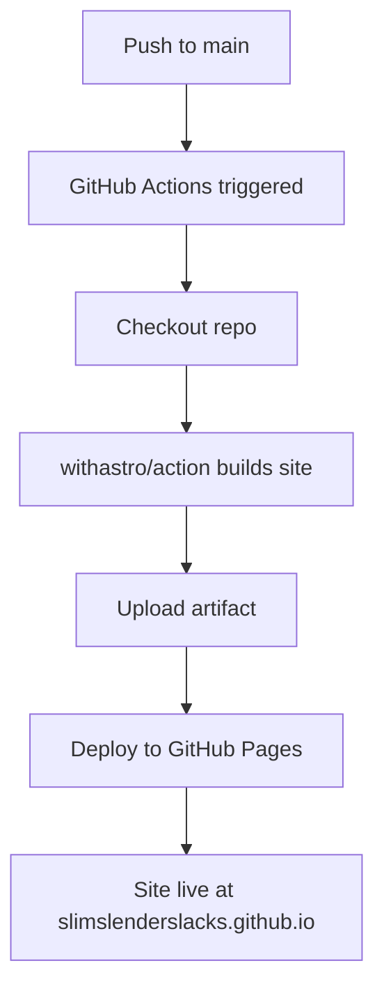
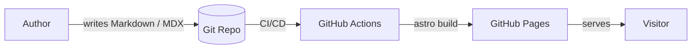
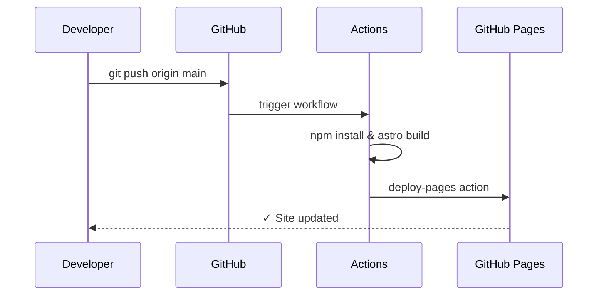
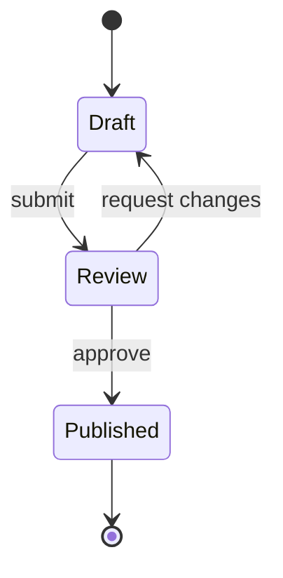

This blog supports [Mermaid](https://mermaid.js.org/) diagrams rendered client-side via the `astro-mermaid` integration. You can embed diagrams directly in Markdown using fenced code blocks with the `mermaid` language tag.

## Deployment Flow

Here's a simple diagram showing how this blog is built and deployed:

## Architecture Overview

## Content Pipeline

## Supported Diagram Types

Mermaid supports many diagram types out of the box:

- **Flowcharts** – decision trees, pipelines
- **Sequence diagrams** – service interactions
- **Class diagrams** – OOP structures
- **Gantt charts** – project timelines
- **Entity relationship diagrams** – data models
- **State diagrams** – finite state machines

