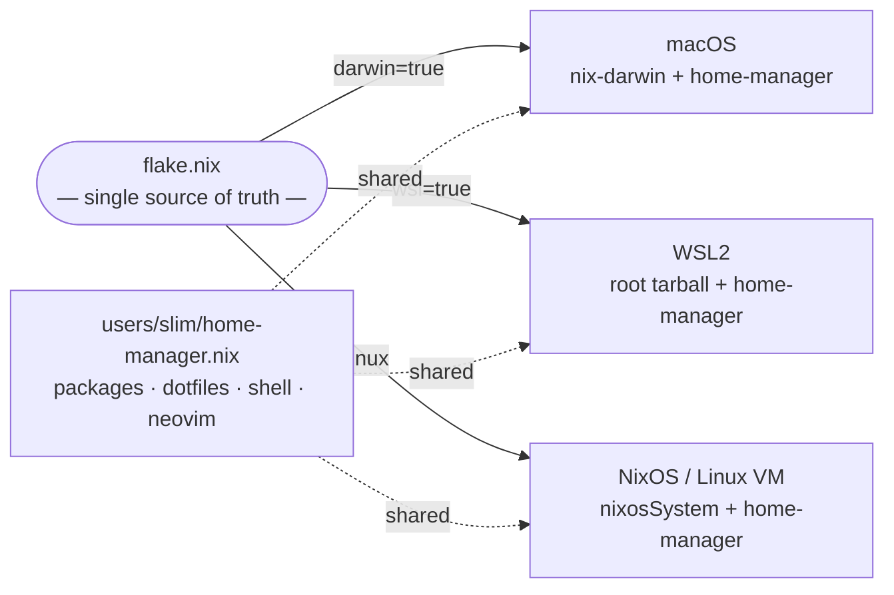

I run the same development environment on a MacBook Pro, inside WSL2 on a Windows machine, and on NixOS VMs. Not "similar" — *identical*. Same packages, same shell config, same editor plugins. One change propagates everywhere.

The tool that makes this possible is Nix, and the config lives at [github.com/slimslenderslacks/nixos-config](https://github.com/slimslenderslacks/nixos-config).

## The problem Nix solves

Most approaches to environment management are per-platform: Homebrew on macOS, `apt` on Linux, something ad-hoc on WSL. Dotfiles help with shell config, but they don't manage the tools themselves. The result is drift — the thing that works on your laptop doesn't quite work on the server.

Nix takes a different approach. Every package is described as a pure function of its inputs, stored in an immutable path like `/nix/store/abc123-ripgrep-14.1.0/`. No global state, no install-time side effects. This means a Nix expression that builds `ripgrep` on macOS is the *same expression* that builds it on NixOS or inside WSL — the output is guaranteed to be identical.

## One flake, three platforms

The entire config is driven from a single `flake.nix`. A central function called `mksystem.nix` takes a machine name and a few flags (`darwin`, `wsl`) and produces either a `darwinSystem` or `nixosSystem`. Critically, all three platform outputs share the same `home-manager.nix` — the file that defines my actual user environment: packages, dotfiles, shell config, neovim.



The platform-specific layers (`darwin.nix`, a machine `.nix` file) handle only what's truly platform-specific: Homebrew casks on macOS, kernel settings on NixOS, WSL-specific tweaks. Everything else — the tools I actually use day to day — lives in `home-manager.nix` and is identical everywhere.

## How macOS fits in

macOS doesn't run NixOS, so there's no NixOS init system or service manager to manage. Instead, [nix-darwin](https://github.com/nix-darwin/nix-darwin) fills that role. It provides a `darwin-rebuild switch` command analogous to `nixos-rebuild switch`, a module system for macOS system config, and integration with Homebrew for GUI apps and macOS-specific tools that work better as casks.

The Nix daemon itself is installed separately — I use the [Determinate Systems nix-installer](https://github.com/DeterminateSystems/nix-installer), which sets up `/nix` and enables flakes. After that, nix-darwin takes over and manages everything else declaratively.

## Getting started

### macOS

1. Install Nix with flakes:
   ```bash
   curl --proto '=https' --tlsv1.2 -sSf -L https://install.determinate.systems/nix | sh -s -- install
   ```

2. Clone the repo and run `make`:
   ```bash
   git clone https://github.com/slimslenderslacks/nixos-config
   cd nixos-config
   NIXNAME=macbook-pro-m1 make
   ```

   On first run, `darwin-rebuild` is bootstrapped directly from the build result — you don't need it pre-installed.

### WSL2

Build a WSL root tarball from any Linux machine (or from NixOS using cross-compilation):

```bash
make wsl
# copies ./result/tarball to Windows, then:
wsl --import nixos .\nixos .\path\to\tarball.tar.gz
wsl -d nixos
```

After `wsl -d nixos` you're dropped directly into the Nix environment. No extra setup.

### NixOS VM

Add a new machine entry to `flake.nix` pointing at `mksystem.nix` with `darwin=false`, add a machine `.nix` file under `machines/`, and run `nixos-rebuild switch --flake .#your-machine`.

## What changes when you update

When I add a package to `home-manager.nix` and run `make switch` on the Mac, the same change is waiting for the WSL and NixOS environments the next time I rebuild them. The flake lock pins all inputs, so every machine builds against the same version of nixpkgs. No surprises.

The config is [on GitHub](https://github.com/slimslenderslacks/nixos-config). It's a fork of Mitchell Hashimoto's nixos-config, adapted for an Apple Silicon MacBook as the primary machine with WSL and NixOS VMs in the mix.
